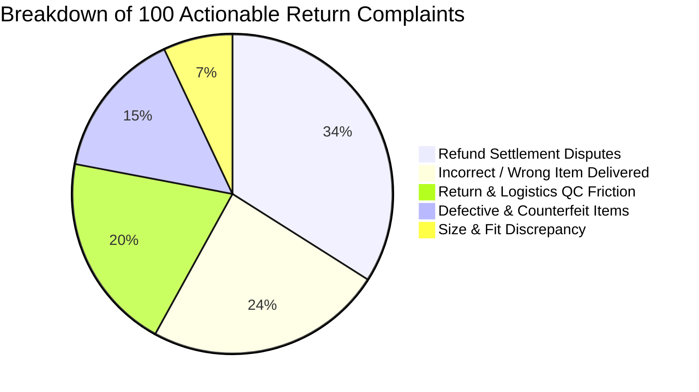
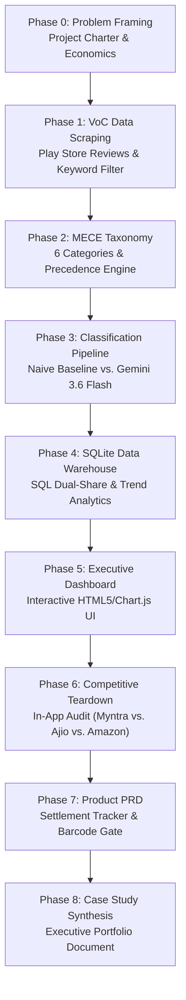

# Myntra Returns & Reverse-Logistics Analysis: From Customer Friction to Product Strategy

[](https://www.python.org/)
[](analysis/returns.db)
[](https://ai.google.dev/)
[](#phase-3-ai-classification-pipeline--rigorous-model-validation)
[](LICENSE)

> **One-Line Project Summary**:  
> **I analyzed customer return friction in Indian fashion e-commerce by mining Google Play Store voice-of-customer reviews, engineering an LLM classification pipeline (Gemini 3.6 Flash) with a formal disambiguation taxonomy, performing SQL warehouse diagnostics, and conducting competitive teardowns to pinpoint high-leverage reverse-logistics and product interventions.**

---

## 📌 Executive Quick Links

| Artifact | Direct Link | Purpose |
| :--- | :--- | :--- |
| 📊 **Interactive Analytics Dashboard** | [`analysis/dashboard.html`](analysis/dashboard.html) | Live interactive dashboard with dual-denominator toggles, filters, and simulator |
| 📄 **Product Requirements Document (PRD)** | [`docs/PRD.md`](docs/PRD.md) | Concrete product specifications for settlement tracking, barcode gates, and doorstep QC |
| 💼 **End-to-End Product Case Study** | [`docs/case_study.md`](docs/case_study.md) | Full PM portfolio case study synthesizing problem, methodology, and ROI |
| 📈 **Executive Summary of Findings** | [`docs/summary_of_findings.md`](docs/summary_of_findings.md) | Consolidated data report, category metrics, and operational recommendations |
| 🔍 **Competitive UX Teardown Notes** | [`design/competitive/teardown_notes.md`](design/competitive/teardown_notes.md) | In-app audit of Myntra vs. Ajio vs. Amazon India with screenshots and policy links |
| 🏷️ **Taxonomy & Precedence Rules** | [`docs/taxonomy.md`](docs/taxonomy.md) | Formal 6-category MECE taxonomy and multi-stage complaint disambiguation engine |
| 🧪 **Classification Validation Benchmark** | [`docs/classification_comparison.md`](docs/classification_comparison.md) | Rule-based baseline vs. Gemini 3.6 Flash benchmark (+77% accuracy delta & 5 edge cases) |
| 🗄️ **Relational Database** | [`analysis/returns.db`](analysis/returns.db) | SQLite warehouse containing tagged reviews, SQL queries, and aggregate outputs |

---

## 💡 Key Quantitative Findings

In fashion e-commerce, returns typically erode **25% to 40%** of gross merchandise value due to reverse logistics (₹70–₹120), warehouse repackaging (₹30–₹50), and inventory depreciation. Through my SQL diagnostics on 389 classified reviews ([`analysis/returns.db`](analysis/returns.db)), I uncovered three critical findings that challenge conventional assumptions:



### 1. The Refund-Processing Visibility Gap (34.00% of Actionable Returns | 1.12★ avg)
- **The Finding**: **34.00% of all actionable return complaints stem from refund delays and financial settlement disputes**, making it the single largest driver of customer dissatisfaction.
- **The Paradox**: In my competitive teardown ([`design/competitive/teardown_notes.md`](design/competitive/teardown_notes.md)), I discovered that while Myntra offers detailed milestone tracking for the *physical parcel* (pickup assigned, courier collected, transit hub scan), **live tracking disappears completely for financial settlement**. Once the package reaches the warehouse, customers face a generic 5–7 day boilerplate statement. Customers wait 10+ days without a bank UTR number, turning routine returns into brand-damaging 1-star disputes.

### 2. Reverse Logistics Has the Lowest Customer Rating (1.05★ | 20.00% Share)
- **The Finding**: While refunds represent the highest complaint volume, **Reverse Logistics & QC Friction inflicts the steepest reputational damage at 1.05★** (95% of reviews rated 1 star).
- **The "Doorstep QC Deadlock"**: 3PL couriers routinely fail pickup windows or falsely update app statuses to *"Customer declined pickup"*. More critically, when a third-party seller dispatches the wrong item, the courier refuses to collect the package because the physical product does not match the app image, trapping the customer in an unresolvable operational loop.

### 3. Warehouse Picking Errors Outweigh Sizing Issues by 3.4x (24.00% vs. 7.00%)
- **The Myth**: Fashion platforms widely assume that size and fit discrepancies are the overwhelming primary cause of apparel returns.
- **The Data Reality**: In my corpus, **upstream warehouse fulfillment errors (24.00%) outnumber authentic size/fit issues (7.00%) by more than 3 to 1**. Third-party marketplace sellers dispatching incorrect size tags or wrong garment models drive massive avoidable reverse-logistics expenses that no sizing recommendation tool can solve.

### Summary Metrics Table

Data source: [`analysis/category_share.csv`](analysis/category_share.csv) and [`analysis/category_ratings.csv`](analysis/category_ratings.csv)

| Category | Review Count | Total Share (N=389) | Actionable Share (N=100) | Avg Rating | Business Impact |
| :--- | :---: | :---: | :---: | :---: | :--- |
| **Refund Processing & Settlement Disputes** | 34 | 8.74% | **34.00%** | **1.12★** | Opaque bank transfers, forced wallet credits, high CS ticket volume |
| **Incorrect / Wrong Item Delivered** | 24 | 6.17% | **24.00%** | **1.13★** | Warehouse picking errors, seller tag mismatches, wrong variants shipped |
| **Return & Exchange Logistics & QC Friction** | 20 | 5.14% | **20.00%** | **1.05★** | Doorstep agent no-shows, false decline statuses, pickup QC deadlocks |
| **Defective, Damaged & Counterfeit Items** | 15 | 3.86% | **15.00%** | **1.07★** | Transit damage, duplicate unbranded goods, tampered return restocking |
| **Size & Fit Discrepancy** | 7 | 1.80% | **7.00%** | **2.57★** | Inaccurate brand size charts, irregular brand tailoring |
| *Other / Not Return-Related (Praise/UI)* | 289 | 74.29% | — | **4.79★** | Filtered keyword false positives and general positive shopping praise |

---

## 🛠️ How This Was Built (Phase-by-Phase Architecture)

I structured this project into discrete, reproducible engineering and product phases:



### Phase 0: Problem Framing & Project Charter
- Authored [`docs/project_charter.md`](docs/project_charter.md) to establish the commercial baseline.
- Modeled the unit economics of fashion returns: ₹70–₹120 dedicated two-way courier costs, ₹30–₹50 warehouse handling/repackaging, and 7–14 days of locked inventory.
- Established that reducing avoidable return rates by just 2–3 percentage points unlocks tens of crores in annual EBITDA savings for an e-commerce platform at Myntra's scale.

### Phase 1: Data Collection & High-Precision Filtering
- Built [`scripts/scrape_reviews.py`](scripts/scrape_reviews.py) to harvest 3,000 raw Google Play Store customer reviews for Myntra and 1,000 benchmark reviews for Ajio.
- Implemented high-precision keyword filtering heuristics (`return`, `refund`, `exchange`, `replacement`, `defective`, `fitting`) to extract 389 candidate return reviews ([`data/myntra_filtered.csv`](data/myntra_filtered.csv)).

### Phase 2: MECE Taxonomy & Precedence Rules
- Formalized a 6-category Mutually Exclusive, Collectively Exhaustive (MECE) classification system in [`docs/taxonomy.md`](docs/taxonomy.md).
- Solved the multi-stage complaint ambiguity problem by engineering deterministic precedence rules:
  1. *Sentiment Filter*: Positive praise containing return keywords is routed to `Other / Not Return-Related`.
  2. *Origin Precedence*: Upstream warehouse dispatch errors override downstream reverse logistics symptoms.
  3. *Financial Resolution Precedence*: Ongoing refund withholding takes precedence over resolved delivery feedback.

### Phase 3: AI Classification Pipeline & Rigorous Model Validation
- Developed two comparative classification engines:
  1. **Naive Keyword Baseline** ([`scripts/baseline_classifier.py`](scripts/baseline_classifier.py)): First-match regex keyword rules.
  2. **GenAI Batch Pipeline** ([`scripts/classify_reviews_gemini.py`](scripts/classify_reviews_gemini.py)): Batch prompt classification using Google's `gemini-3.6-flash` model with taxonomy constraints.
- Sampled 100 human-verified ground-truth reviews ([`data/validation_set.csv`](data/validation_set.csv)) via [`scripts/create_validation_set.py`](scripts/create_validation_set.py).
- Documented in [`docs/classification_comparison.md`](docs/classification_comparison.md):
  - **Keyword Baseline Accuracy**: **19.00%** (81% error rate).
  - **GenAI Model Accuracy**: **96.00%** (4% error rate).
  - **Performance Delta**: **+77.00 percentage points**.
  - Documented 5 deep-dive linguistic failure modes of rule-based systems (sentiment blindness, polysemy, first-match ordering bias, vocabulary rigidity, multi-stage journeys).

### Phase 4: SQLite Data Warehouse & SQL Diagnostics
- Modeled the classified dataset into a relational SQLite database at [`analysis/returns.db`](analysis/returns.db) with table schema `reviews(review_id, text, rating, date, genai_category)`.
- Engineered automated SQL queries in [`scripts/run_sql_analysis.py`](scripts/run_sql_analysis.py):
  - Calculated dual category share (once across all 389 reviews, and once across the 100 actionable return complaints excluding praise).
  - Computed category sentiment ratings and min/max ranges.
  - Analyzed daily complaint velocity across the observation window.

### Phase 5: Interactive Executive Analytics Dashboard
- Designed and built [`analysis/dashboard.html`](analysis/dashboard.html) using vanilla HTML, CSS, and Chart.js.
- Features:
  - Dual-denominator toggle (Total N=389 vs. Actionable N=100).
  - Dynamic KPI cards with live sentiment tags.
  - Full-coverage return category simulation model covering all 5 return complaint types.
  - Interactive verbatim review quote cards reflecting genuine customer voices.

### Phase 6: Competitive UX & Return Policy Teardown
- Conducted an in-app audit across **Myntra**, **Ajio**, and **Amazon India**, supplemented with aspirational benchmarks from **The Souled Store** (D2C apparel) and **Nykaa** (beauty).
- Documented in [`design/competitive/teardown_notes.md`](design/competitive/teardown_notes.md) with visual app screenshots and verified public policy URLs:
  - **Finding 1**: Myntra leads direct competitors with a **14-day return window** (vs. 10 days on Ajio and Amazon India).
  - **Finding 2**: Disproved initial hypothesis regarding return-window-closed messaging—Myntra explicitly displays clear closure timestamps on order cards on par with Amazon.
  - **Finding 3 (The Core Insight)**: Uncovered the critical physical vs. financial tracking asymmetry across platforms.

### Phase 7: Product Requirements Document (PRD)
- Authored [`docs/PRD.md`](docs/PRD.md) specifying four production-grade features:
  1. *Live Financial Settlement Tracker*: In-app 5-step milestone tracker with bank UTR numbers.
  2. *Instant Webhook Refund Disbursal*: Automatic payout upon doorstep pickup scan for low-risk customers.
  3. *Mandatory Pre-Dispatch 2D Barcode Verification*: Packing station scanning gate eliminating warehouse mispicks.
  4. *Calibrated Doorstep QC*: Photo-verified pickup handover for wrong-item seller dispatches.

### Phase 8: End-to-End Product Case Study
- Synthesized the complete analysis into [`docs/case_study.md`](docs/case_study.md), providing a recruiter-ready PM case study detailing problem framing, engineering methodology, competitive teardown, and commercial ROI.

---

## 🔬 Limitations & Methodological Rigor

Transparently addressing research constraints reflects product maturity:

1. **Play Store Reviews as an Imperfect Proxy for Absolute Return Rates**:  
   Public app store reviews inherently over-index on negative sentiment and acute escalation pain points (complaint bias). They do not reflect internal Warehouse Management System (WMS) volume baselines. For example, a customer whose return and refund completed seamlessly within 24 hours rarely writes a Play Store review about it.
2. **Sample Size & Temporal Window**:  
   The primary dataset consists of 389 keyword-filtered reviews captured between **September 5 and September 10, 2026** (yielding 100 actionable return complaints). While statistically robust for qualitative root-cause identification and linguistic benchmarking, product prioritization at enterprise scale should calibrate these ratios against internal Myntra telemetry (100k+ monthly return tickets).
3. **Absence of Internal SKU & Logistics Partner Metadata**:  
   Public reviews do not expose internal seller IDs, category tags, or courier partner codes (e.g., Delhivery vs. Shadowfax vs. Ecom Express). Operational investigations into specific third-party seller defect rates or regional courier SLA breaches require internal database access.
4. **Historical Order Audit in Teardowns**:  
   Due to account order timing, the competitive UX teardown evaluated delivered order cards and public Help Center documentation rather than initiating a live active return transaction at the exact moment of the audit.

---

## 💻 Local Setup & Replication

To reproduce this analysis, run queries, or inspect the dashboard locally:

### 1. Clone & Set Up Environment
```bash
# Clone the repository
git clone https://github.com/Dhruv-Maheshwari16/myntra-return-analysis.git
cd myntra-returns-analysis

# Create and activate a virtual environment
python -m venv venv
# On Windows:
.\venv\Scripts\activate
# On macOS/Linux:
source venv/bin/activate

# Install required packages
pip install pandas google-genai python-dotenv
```

### 2. Configure API Keys
Create a `.env` file in the root directory (based on `.env.example`):
```ini
GEMINI_API_KEY=your_gemini_api_key_here
```

### 3. Run the Data Pipeline
```bash
# 1. Scrape Play Store reviews
python scripts/scrape_reviews.py

# 2. Run the Naive Keyword Baseline classifier
python scripts/baseline_classifier.py

# 3. Run the GenAI Batch Classification pipeline
python scripts/classify_reviews_gemini.py

# 4. Generate the 100-review validation benchmark
python scripts/create_validation_set.py

# 5. Populate the SQLite warehouse and generate analytical CSVs
python scripts/run_sql_analysis.py
```

### 4. View the Interactive Dashboard
Open [`analysis/dashboard.html`](analysis/dashboard.html) directly in any web browser:
```powershell
# On Windows PowerShell:
Start-Process "analysis\dashboard.html"
```

---

## 👤 Author & Project Context

- **Author**: Dhruv Maheshwari
- **Role**: Product Management & Analytics Portfolio Project
- **GitHub**: [@Dhruv-Maheshwari16](https://github.com/Dhruv-Maheshwari16)
- **Repository**: [myntra-return-analysis](https://github.com/Dhruv-Maheshwari16/myntra-return-analysis)
