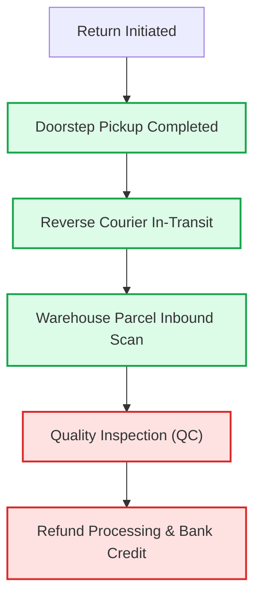

# Competitive Teardown Notes: Return & Refund User Flows

**Document**: `design/competitive/teardown_notes.md`  
**Focus Area**: Competitive Policy & Flow Teardown (Myntra vs. Ajio vs. Amazon India)  
**Author Perspective**: First-person product teardown & manual audit  

---

## 1. Research Methodology

To understand how Myntra's return policies and user experience compare with the broader Indian e-commerce landscape, I conducted a manual audit across three leading platforms: **Myntra**, **Ajio**, and **Amazon India**.

- **Audit Process**: I personally audited the order history, product display pages (PDP), return policy disclosures, and post-delivery order cards using my own personal mobile accounts and past purchases on each app.
- **Aspirational Benchmarks**: I supplemented this direct teardown with publicly known return policy frameworks from specialized vertical players—specifically **The Souled Store** (D2C apparel) and **Nykaa** (beauty & lifestyle)—to benchmark emerging industry practices.

---

## 2. Finding 1: Return Window Length (Myntra Leads Direct Competitors)

My analysis reveals that **Myntra currently offers the most generous return window among horizontal fashion competitors**:

- **Myntra**: **14-day** return & exchange window.
- **Ajio**: **10-day** return & exchange window.
- **Amazon India**: **10-day** return & exchange window for fashion/apparel.

### Visual Evidence from Product Display Pages (PDP)

#### Myntra — 14-Day Policy Disclosure
On Myntra's product display page, the policy is prominently badged as *"Hassle free 14 days Return & Exchange"* alongside clear terms: *"Choose to return or exchange for a different size (if available) within 14 days."*

---

#### Ajio — 10-Day Policy Disclosure
On Ajio's product page under *Delivery & Return Details*, the platform specifies a **10 day Return and Exchange** window with a link to secondary policy rules.

---

#### Amazon India — 10-Day Policy Disclosure
Under Amazon's *Shop with confidence* section, fashion apparel listings display a **10 days Return & Exchange** guarantee.

---

### Comparative Policy Summary

| Dimension | Myntra | Ajio | Amazon India | Strategic Assessment |
| :--- | :---: | :---: | :---: | :--- |
| **Return Window** | **14 Days** | 10 Days | 10 Days | **Myntra leads by +4 days**, providing the most lenient window among major competitors. |
| **Exchange Window** | **14 Days** | 10 Days | 10 Days | Matches return window across all three platforms. |
| **PDP Visibility** | High (Two badges + subtext) | Moderate (Single line item) | High (Icon-based trust row) | Myntra provides explicit clarity directly above the size selector and specs. |

---

## 3. Finding 2: Return-Window-Closed Messaging (Correcting My Initial Hypothesis)

### The Initial Hypothesis
Going into this research, my initial hypothesis was that Myntra silently removes the return button once the window expires without giving users any context or clear closure messaging, leaving customers confused about why they cannot initiate a return.

### What the Evidence Actually Shows
My audit disproved this assumption. **Myntra explicitly communicates window expiration directly on the order card**, exactly on par with Amazon:

- **Myntra's In-App Order Card**: Explicitly displays a dedicated notification banner:  
  `Exchange/Return window closed on Wed, 9 Jul 2025` and `Exchange/Return window closed on Tue, 8 Jul 2025`.
- **Amazon's In-App Order Card**: Displays a comparable inline label under order info:  
  `Return window closed on 24 July 2026`.

### Visual Evidence from Closed Order Cards

#### Myntra Order History Card

*Myntra explicitly informs me of the exact date on which my return window lapsed, eliminating ambiguity.*

---

#### Amazon India Order History Card

*Amazon displays the closed return window date under order info in a similarly direct manner.*

### Takeaway
There is **no meaningful competitive UX gap** regarding closed-window transparency. The customer frustration surfaced in my VoC review data is not caused by missing closure timestamps; rather, it stems from systemic delays where exchange orders drag out until the window quietly lapses in the background.

---

## 4. Finding 3: Package Tracking Exists, But Live Refund/Settlement Status Does Not (The Sharpest Finding of This Phase)

This is the **sharpest and most actionable insight** from my teardown.

When examining the post-purchase journey across Myntra, Ajio, and Amazon, I found an acute asymmetry between physical parcel tracking and financial settlement tracking:

### The Visibility Asymmetry
1. **Physical Reverse Logistics (Tracked in Detail)**:  
   All three platforms offer granular tracking for the physical return parcel. A customer can see when the pickup was assigned, when the delivery boy completed doorstep collection, when the parcel left the city hub, and when it physically arrived at the return sorting center.
2. **Financial Settlement (A Complete Black Box)**:  
   Once the package is delivered to the warehouse, live order-specific progress disappears completely. Platforms replace active tracking with a static, generic boilerplate statement (e.g., *"Refund will be credited within 5–7 business days after successful quality check"*).

### Why This Matters to Myntra's Product Strategy
This opacity gap aligns directly with the findings from my quantitative analysis:
- **34.0% of all actionable return complaints** in my dataset fall under **Refund Processing & Settlement Disputes**.
- Customers can verify via tracking that Myntra's courier received their item days ago, but they have zero visibility into:
  - Has warehouse QC passed or failed?
  - Has the finance webhook triggered the refund?
  - What is the bank reference / UTR number for their UPI or card account?

Because customers perceive their funds as being withheld without accountability, this visibility void turns a routine return into a high-churn, brand-damaging customer dispute.

---

## 5. Finding 4: Aspirational Benchmark — Risk-Based Return Policy Differentiation

Looking beyond direct horizontal competitors, I reviewed return policies across specialized vertical commerce platforms:

### 1. The Souled Store (D2C Apparel Benchmark)
- **Policy**: Offers a **30-day return window** (more than double Myntra's 14-day window).
- **Business Logic**: As a single-brand D2C player with centralized fabric sourcing and consistent master patterns, their size-variance risk is substantially lower than a multi-brand marketplace. They leverage a longer window as a marketing trust driver with minimal risk of margin leakage.

### 2. Nykaa (Beauty & Fragrance Benchmark)
- **Policy**: Permits returns on select sealed fragrance and beauty SKUs under strictly defined conditions.
- **Business Logic**: Rather than applying a blanket, blunt non-returnable policy across all personal care items, Nykaa differentiates by tamper-evident seal integrity and product category risk.

### Strategic Implication for Myntra
Myntra currently enforces a largely flat return policy across diverse sellers and categories. My teardown suggests an opportunity to explore **risk-based, tiered return policies**:
- **Low-Risk Brands / Assured Lines**: Verified brands with high fit accuracy and low defect histories could support extended windows or instant refunds.
- **High-Risk Marketplace SKUs**: Sellers with repeat counterfeit flags or high wrong-item dispatch rates should have mandatory pre-dispatch barcode scanning and tighter QC gates.

---

## 6. Limitations of This Phase

To maintain academic and professional rigor, I note two specific constraints encountered during this teardown:

1. **No Live Return-Reason Selection Screen Audited**:  
   Because none of my personal orders were within an active, unexpired return window at the exact time of this research, I could not screen-capture the active, dynamic return dropdowns (e.g., the specific cascading choices between *"Wrong Item"*, *"Size issue"*, *"Defective"*).
2. **Policy & Help Center Sourced for Settlement Opacity**:  
   The distinction between live package tracking and generic refund boilerplate in Finding 3 is derived from my general platform familiarity and verified Help Center policy documentation across the platforms, rather than a live contemporaneous return execution.

---

## 7. Official Policy References & Public Links

For verification and independent audit, here are the official return and exchange policy pages across all researched brands:

| Brand | Platform Type | Return Window | Official Public Policy Link |
| :--- | :--- | :---: | :--- |
| **Myntra** | Direct Competitor (Horizontal Fashion) | **14 Days** | [Myntra Return & Exchange Policy (FAQs)](https://www.myntra.com/faqs#returns) &bull; [Myntra Terms & Conditions](https://www.myntra.com/tac) |
| **Ajio** | Direct Competitor (Horizontal Fashion) | **10 Days** | [Ajio Return & Refund Policy](https://www.ajio.com/return-refund-policy) &bull; [Ajio Customer Support Helpdesk](https://www.ajio.com/help/returns) |
| **Amazon India** | Direct Competitor (Horizontal E-Commerce) | **10 Days** | [Amazon India Returns & Refund Policy](https://www.amazon.in/gp/help/customer/display.html?nodeId=202111910) &bull; [Amazon Returns Center](https://www.amazon.in/returns) |
| **The Souled Store** | Aspirational Benchmark (D2C Apparel) | **30 Days** | [The Souled Store Returns & Exchange Portal](https://www.thesouledstore.com/returns) &bull; [The Souled Store FAQs](https://www.thesouledstore.com/faqs) |
| **Nykaa** | Aspirational Benchmark (Vertical Lifestyle) | **Varies by Category** | [Nykaa Cancellation & Return Policy](https://www.nykaa.com/cancellation-policy) &bull; [Nykaa Help Center](https://www.nykaa.com/help-center) |

