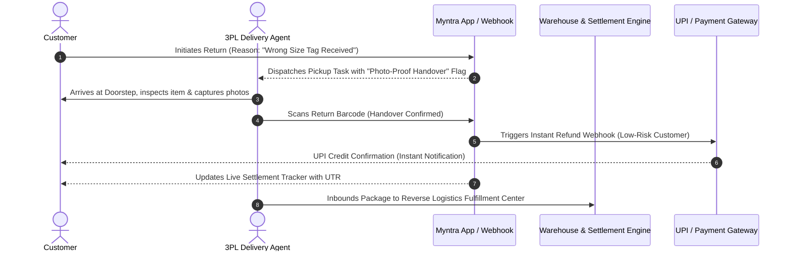

# Product Requirements Document (PRD): Reverse Logistics & Post-Return Experience Optimization

**Document Status**: Draft / In Progress (Phase 7 Milestone)  
**Author**: Dhruv Maheshwari  
**Perspective**: Product Management (First-Person POV)  
**Target Platform**: Myntra Android & iOS Consumer App + Warehouse Management System (WMS)  
**Related Analysis**: [`docs/summary_of_findings.md`](summary_of_findings.md) &bull; [`design/competitive/teardown_notes.md`](../design/competitive/teardown_notes.md) &bull; [`analysis/dashboard.html`](../analysis/dashboard.html)

---

## 1. Executive Summary & Problem Background

In my quantitative Voice of Customer (VoC) analysis of 389 classified Myntra Play Store customer reviews ([`analysis/returns.db`](../analysis/returns.db)), I identified three acute operational bottlenecks undermining customer trust and unit economics in Myntra's reverse logistics pipeline:

1. **The Refund Settlement Black Box (34.00% of complaints | 1.12★ avg)**:  
   Refund delays and settlement opacity represent the single largest driver of return dissatisfaction. While package logistics are tracked in granular detail, financial settlement status disappears into generic boilerplate once the item reaches the hub.
2. **Doorstep Logistics & QC Deadlocks (20.00% of complaints | 1.05★ avg)**:  
   Reverse courier no-shows, false decline statuses (*"Customer cancelled pickup"*), and rigid doorstep QC rules trap customers in circular escalation loops, generating near-unanimous 1-star ratings.
3. **Upstream Warehouse Fulfillment Errors (24.00% of complaints | 1.13★ avg)**:  
   Third-party seller tag mismatches and incorrect dispatches outweigh authentic size/fit issues (7.00%) by **3.4x**, generating entirely avoidable return shipping and handling expenses (~₹100–₹170 per occurrence).

This PRD defines four strategic product interventions to eliminate settlement anxiety, streamline doorstep returns, and prevent outbound picking errors.

---

## 2. Strategic Objectives & Success Metrics (OKRs)

### Core Objective
Transform Myntra's post-purchase return experience from a high-churn friction point into a brand differentiator, reducing avoidable return volume and slashing return-related negative customer escalations.

### Key Performance Indicators (KPIs)
- **Reduce Refund-Related Support Tickets by 60%** within 60 days of rolling out the Live Settlement Tracker.
- **Lower Doorstep Return Rejection Rate by 45%** by enabling photo-verified handover for incorrect seller dispatches.
- **Decrease Wrong-Item Return Inbound Rate from 24% to <8%** through mandatory pre-dispatch 2D barcode scanning.
- **Lift Post-Return CSAT from 1.12★ to 3.8★+** by initiating instant UPI refunds upon courier pickup scan for low-risk customers.

---

## 3. Product Initiatives & Feature Specifications

### Initiative 1: Live Financial Settlement Tracker (In-App)
- **Problem Addressed**: Customers have visibility into physical parcel transit, but no insight into warehouse inspection, finance approval, or bank UTR reference numbers.
- **Feature Scope**:
  - Add a dedicated **Refund Timeline** inside the Myntra Order Details page.
  - Granular milestones:
    1. *Pickup Completed* (with agent timestamp).
    2. *Hub Inbound Scan & Initial Triage*.
    3. *Quality Check Completed* (Passed / Exception Flagged).
    4. *Refund Initiated* (Displaying exact Bank Reference / UTR number for UPI and NetBanking).
    5. *Credited to Account*.
  - Automatic push notification & WhatsApp alert when UTR is generated.

### Initiative 2: Instant UPI Refund Disbursal upon Pickup Handover
- **Problem Addressed**: Customers wait 7–14 days for warehouse arrival and manual grading before their money is released.
- **Feature Scope**:
  - Trigger automated instant refund disbursement via UPI / payment gateway webhook immediately upon the 3PL courier scanning the return shipping polybag at the customer's doorstep.
  - Risk-calibrated eligibility rules:
    - High-reputation customers (low historic return rate, Myntra Insider tier) receive instant refund up to ₹5,000.
    - High-risk categories (high-value electronics, luxury watches, non-returnable beauty) retain standard warehouse-gated inspection.

### Initiative 3: Mandatory Pre-Dispatch 2D Barcode Verification (WMS / Packing Station)
- **Problem Addressed**: 24% of return complaints stem from sellers shipping the wrong size tag or completely incorrect garments.
- **Feature Scope**:
  - Update the warehouse packing station UI: Packers must scan both the **individual garment tag barcode** and the **shipping polybag airway bill (AWB)** before the shipping label can be printed.
  - Hard system block: If the physical garment SKU does not match the customer's ordered SKU in the ERP, the system prohibits label generation and routes the item to a rework bin.

### Initiative 4: Calibrated Doorstep QC with Photo-Proof Handover
- **Problem Addressed**: When a seller ships the wrong item, 3PL delivery agents refuse to pick it up because it does not match the catalog thumbnail, leaving the customer trapped.
- **Feature Scope**:
  - In the delivery agent's mobile app (Logistics Partner SDK): If the customer flagged *"Received Wrong / Incorrect Item"* during the return request, replace the strict visual match gate with a mandatory **in-app photo capture requirement**.
  - The delivery agent captures two photos of the item and tag, bags the parcel with a tamper-evident seal, and hands over the return receipt.

---

## 4. User Flow & Architecture Overview

---

## 5. Non-Functional Requirements & Rollout Plan

1. **Scalability**: Webhook settlement engine must handle peak Big Fashion Festival (BFF) loads of 50,000 concurrent return handovers without latency degradation (>99.9% uptime).
2. **Fraud Prevention**: Implement anomaly detection for serial returners and high-value orders; flag suspicious clusters for secondary manual warehouse grading.
3. **Phased Rollout**:
   - *Phase A (Pilot)*: Live Settlement Tracker launched in Bangalore & Delhi-NCR for top 100 marketplace apparel brands.
   - *Phase B (Expansion)*: Instant UPI refunds enabled for Myntra Insider Elite members.
   - *Phase C (Scale)*: WMS 2D barcode scan enforced across all Tier-1 fulfillment centers.

---

## 6. Document History & Next Steps
- **Current Status**: Foundational requirements drafted based on Phase 4 SQL metrics and Phase 6 competitive teardowns.
- **Next Step**: Wireframe specifications and technical API schema integration for the Live Settlement Tracker.
