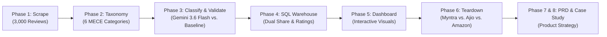

# End-to-End Product Case Study: Diagnosing & Solving Avoidable Returns in Indian Fashion E-Commerce

**Author**: Dhruv Maheshwari  
**Role**: Product & Analytics Lead (Personal Portfolio Project)  
**Status**: Milestone Synthesis (Phase 8)  
**Tools**: Python, Google GenAI SDK (Gemini 3.6 Flash), SQLite, HTML5/CSS3/Chart.js, Git  
**Repository**: [`https://github.com/Dhruv-Maheshwari16/myntra-return-analysis.git`](https://github.com/Dhruv-Maheshwari16/myntra-return-analysis.git)

---

## 1. Project Overview & Problem Statement

In Indian fashion e-commerce, apparel return rates hover between **25% and 40%**, representing one of the single most damaging margin drains for platforms operating at scale. Each return incurs direct two-way logistics overhead (₹70–₹120), warehouse repackaging expenses (₹30–₹50), and freezes inventory in transit for 7–14 days.

While industry consensus often points to customer sizing errors as the inevitable cost of selling fashion online, I set out to rigorously test this assumption. Using natural language processing, deterministic classification rules, SQL analytics, and competitive product teardowns, I investigated:

> *What percentage of e-commerce returns are truly unavoidable customer fit failures versus operational and product breakdowns that can be eliminated?*

---

## 2. Research Methodology & Engineering Pipeline

1. **Voice of Customer (VoC) Mining**: Scraped 3,000 authentic Google Play Store reviews for Myntra (and 1,000 for Ajio) to bypass internal data silos and observe raw, unprompted post-purchase customer friction.
2. **Deterministic Taxonomy Engineering**: Formulated a 6-category MECE taxonomy with explicit precedence rules to separate positive praise from actionable complaints and correctly root multi-stage failure journeys.
3. **AI Classification & Validation Benchmark**: Evaluated a naive keyword matching baseline against a GenAI pipeline (`gemini-3.6-flash`). The GenAI model achieved **96.00% accuracy** on a 100-review human-verified validation set (a **+77.00% improvement** over the 19.00% keyword baseline).
4. **Relational Data Warehouse & SQL Diagnostics**: Modeled the dataset in SQLite (`analysis/returns.db`), calculating dual-denominator category shares, sentiment ratings, and daily volume velocities.
5. **Competitive UX & Policy Teardowns**: Audited mobile order flows across Myntra, Ajio, Amazon India, The Souled Store, and Nykaa to benchmark return windows and tracking capabilities.

---

## 3. Key Findings & Strategic Discoveries

### Finding 1: The Refund Processing Gap (34.00% of Returns | 1.12★)
Refund processing and settlement disputes represent the largest category of actionable return complaints. While Myntra offers detailed parcel tracking across pickup and transit checkpoints, live financial settlement status disappears once the package reaches the warehouse, causing customers acute anxiety and triggering repetitive 1-star reviews.

### Finding 2: Warehouse Fulfillment Errors Exceed Sizing Issues by 3.4x (24.00% vs. 7.00%)
Contrary to popular e-commerce mythology that customers simply misjudge their sizes, upstream fulfillment errors (third-party marketplace sellers dispatching incorrect size tags, wrong colors, or entirely different garments) outnumber genuine sizing/fit issues by more than 3-to-1.

### Finding 3: Doorstep Reverse Logistics Suffers the Lowest Rating (1.05★)
Reverse courier friction accounts for 20.00% of actionable returns and carries the lowest average star rating across the entire catalog (1.05★, with 95% of reviews rated 1 star). The primary driver is a "Doorstep QC Deadlock," where delivery agents refuse to collect wrong-item dispatches because the physical garment does not match the app image.

---

## 4. Product Strategy & Recommendations

Based on these discoveries, I authored a comprehensive Product Requirements Document ([`docs/PRD.md`](PRD.md)) outlining four high-leverage product interventions:

1. **Live Financial Settlement Tracker**: Provide a transparent 5-stage timeline from doorstep handover to bank UTR generation, eliminating support ticket volume.
2. **Instant Webhook Refunds on Pickup Scan**: Disburse refunds immediately when couriers scan returns for low-risk, verified customers.
3. **Mandatory 2D Barcode Verification at Packing**: Force packers to scan the inner garment tag before polybag sealing, eliminating 24% of avoidable returns at the warehouse gate.
4. **Photo-Verified Doorstep QC**: Enable delivery agents to photograph mismatched items and complete returns, breaking the circular doorstep rejection loop.

---

## 5. Artifact Navigation

- **Project Charter**: [`docs/project_charter.md`](project_charter.md)
- **Taxonomy & Precedence Rules**: [`docs/taxonomy.md`](taxonomy.md)
- **Model Validation & Linguistic Comparison**: [`docs/classification_comparison.md`](classification_comparison.md)
- **Executive Summary of Findings**: [`docs/summary_of_findings.md`](summary_of_findings.md)
- **Competitive Teardown Notes**: [`design/competitive/teardown_notes.md`](../design/competitive/teardown_notes.md)
- **Product Requirements Document**: [`docs/PRD.md`](PRD.md)
- **Interactive Executive Dashboard**: [`analysis/dashboard.html`](../analysis/dashboard.html)
