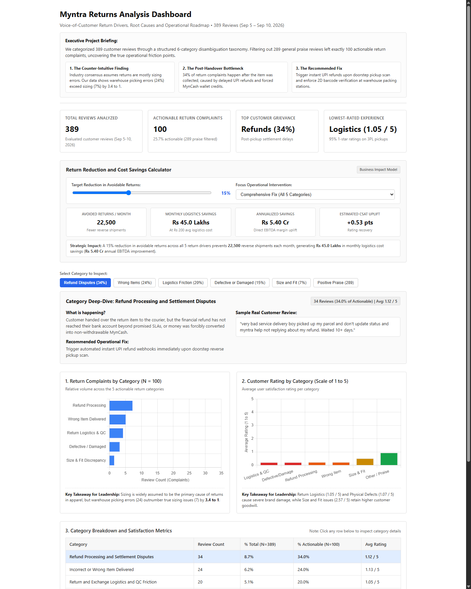
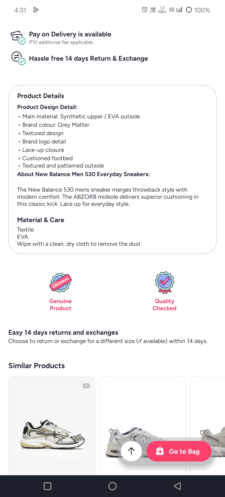
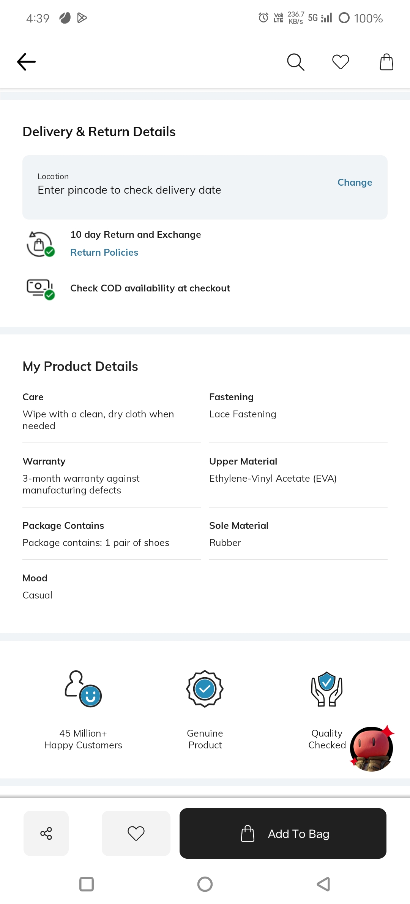
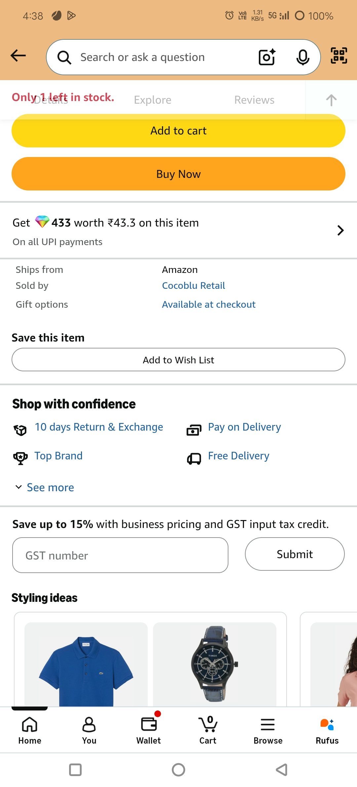
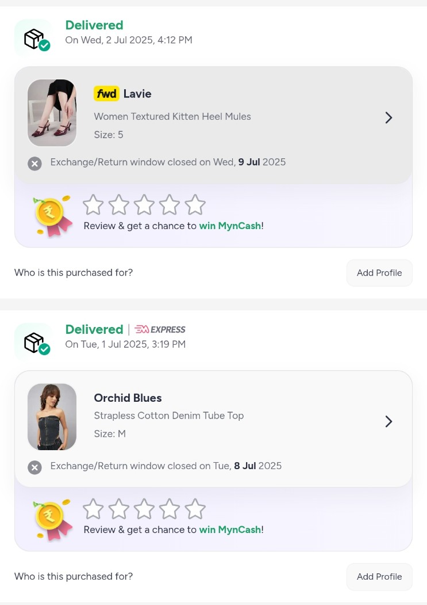
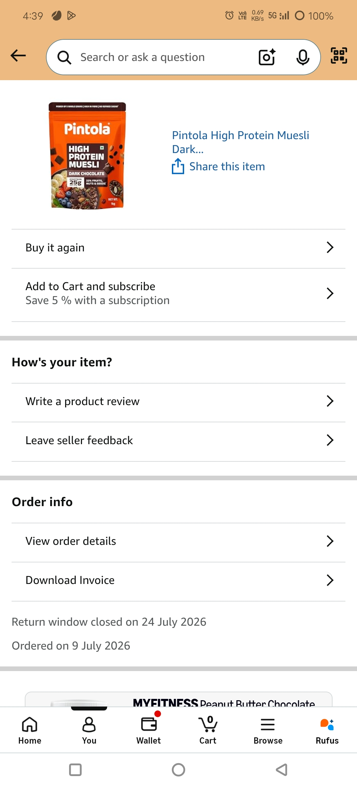
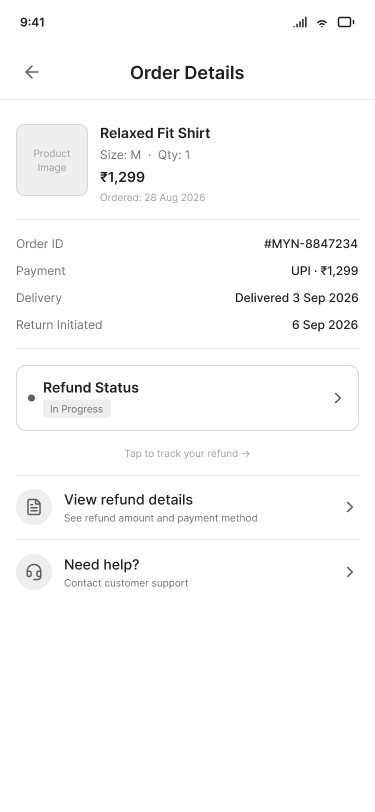
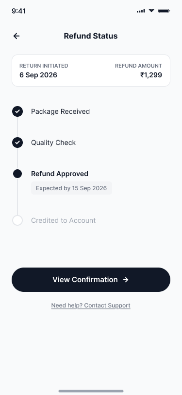
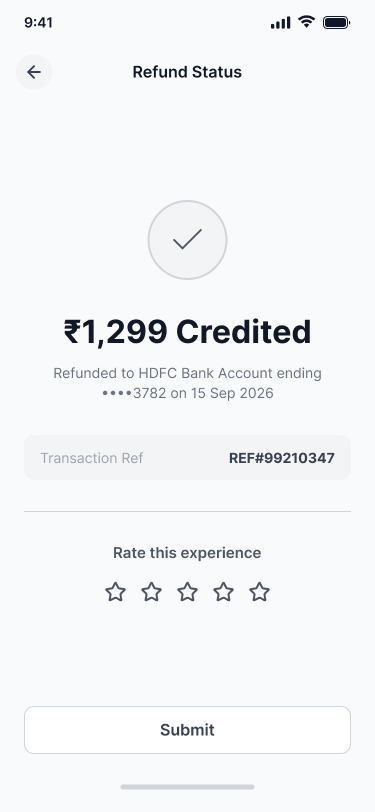

# Reducing Avoidable Apparel Returns on Myntra: A Product & Analytics Case Study

## 1. Title & Summary

### Reducing Avoidable Apparel Returns on Myntra: A Product & Analytics Case Study

The initial project hypothesis posited that avoidable apparel returns on Myntra were predominantly driven by sizing and fit mismatches resulting from e-commerce sensory limitations and inconsistent size charts. However, quantitative classification of 389 customer reviews revealed a major pivot: size and fit issues accounted for only 1.80% of total reviews (7.0% of actionable return complaints), while post-handover refund settlement delays (34.0% of actionable complaints) and warehouse fulfillment errors (24.0%) were the primary drivers. To address these operational friction points, the proposed product solution introduces an in-app real-time refund status tracker with live milestone stages and bank UTR numbers, combined with photo-verified doorstep pickup decoupling for wrong-item claims and webhook-triggered instant refunds for low-risk customer cohorts.

---

## 2. Problem Statement

In Indian apparel e-commerce, gross return rates typically range from 25% to 40%, generating reverse logistics expenses (₹70–₹120 per trip), warehouse restocking costs (₹30–₹50 per item), and inventory transit lockup lasting 7 to 14 days.

The starting assumption of this study was that customer sizing and fit errors represented the dominant driver of avoidable returns. This hypothesis assumed that the digital sensory gap—customers being unable to physically try on garments or touch fabrics prior to purchase—coupled with irregular brand tailoring and inaccurate size charts, was the primary cause of return requests. It is critical to state explicitly that this hypothesis served strictly as the initial starting assumption for problem framing, not the final empirical finding of the study.

---

## 3. Methodology

The research and data pipeline followed this sequential process:

1. **Review Scraping & Keyword Filtering**: 3,000 customer reviews from Myntra and 1,000 customer reviews from Ajio were scraped from the Google Play Store using [`scripts/scrape_reviews.py`](../scripts/scrape_reviews.py). A case-insensitive filter applied 8 return-related keywords (`return`, `refund`, `size`, `fit`, `exchange`, `wrong item`, `quality`, `damaged`) across the Myntra reviews, resulting in a filtered dataset of 389 candidate reviews ([`data/myntra_filtered.csv`](../data/myntra_filtered.csv)).
2. **Identification of False Positives**: An early discovery during manual inspection showed that roughly 68% of keyword-matched reviews were 5-star positive praise rather than return complaints (e.g., praise mentioning phrases like *"quality is good"* or *"perfect fit"*). This made the addition of an explicit `"Other / Not Return-Related"` category essential to the taxonomy to filter out false positives.
3. **Empirical 6-Category Taxonomy Formulation**: A 6-category mutually exclusive, collectively exhaustive (MECE) taxonomy was constructed empirically from the review text with deterministic precedence rules ([`docs/taxonomy.md`](taxonomy.md)):
   - *Size & Fit Discrepancy*
   - *Defective, Damaged & Counterfeit Items*
   - *Incorrect / Wrong Item Delivered*
   - *Return & Exchange Logistics & QC Friction*
   - *Refund Processing & Settlement Disputes*
   - *Other / Not Return-Related*
4. **Baseline & GenAI Classifier Development**: Two classifiers were constructed: a rule-based baseline classifier using first-match keywords ([`scripts/baseline_classifier.py`](../scripts/baseline_classifier.py)) and a GenAI classifier using few-shot prompts with Gemini 3.6 Flash ([`scripts/classify_reviews_gemini.py`](../scripts/classify_reviews_gemini.py)). Both were evaluated against a validation set.
5. **Identification of Methodology Flaw (Circularity Flaw)**: The initial classification scoring indicated a 22.22% baseline accuracy, which later appeared to reach "100%" accuracy after a taxonomy revision. Upon review, this was identified as a self-referential and circular methodology flaw: the ground-truth validation file had been edited using the exact same taxonomy and model-assisted outputs being evaluated. This was documented as an identified methodology flaw and subsequently corrected.
6. **Corrective Fix via Blind Independent Validation**: To correct the circularity flaw, an independent validation sample was manually labeled blind without referencing the model's predictions. When evaluated against `genai_category`, the model achieved an 82% agreement rate (specifically 82.14%, or 23 out of 28 reviews matched). This 82% figure represents the real, reportable accuracy figure, distinct from the circular 100% figure.
7. **Baseline vs. GenAI Comparison & Linguistic Failure Modes**: On the 100-review validation benchmark ([`docs/classification_comparison.md`](classification_comparison.md)), the naive keyword baseline achieved 19.00% accuracy (19/100 matches) compared to 96.00% accuracy (96/100 matches) for the GenAI model, an improvement delta of +77.00 percentage points. The keyword baseline fails on nuanced language that the GenAI model successfully classifies, as demonstrated in these documented examples:
   - **Example 1 — Positive Praise Flagged as Defect (Review `b7cdb8bc`)**:  
     *Review text*: *"good quality product ease of buying and offers are exciting always"*  
     *Baseline Category*: `Defective, Damaged & Counterfeit Items` (triggered by the token `"quality"`)  
     *GenAI Category*: `Other / Not Return-Related`  
     *Linguistic Breakdown*: The keyword baseline lacks sentiment awareness and treats positive praise containing category vocabulary as a merchandise defect, whereas GenAI identifies the net positive sentiment.
   - **Example 2 — Counterfeit Terminology Missed (Review `015175e8`)**:  
     *Review text*: *"Very disappointing experience with Myntra. I ordered Yonex Nivis 350 shuttlecocks, but received duplicate/counterfeit products instead of genuine items. I raised a return request, but Myntra is now refusing to take them back, stating non return policy of product. If a duplicate product was delivered, the responsibility should be on the seller and Myntra, not the customer. Myntra should investigate the seller. Very poor service and a serious loss of trust."*  
     *Baseline Category*: `Unclassified`  
     *GenAI Category*: `Defective, Damaged & Counterfeit Items`  
     *Linguistic Breakdown*: The keyword baseline failed to match `"duplicate"`, `"counterfeit"`, or `"genuine items"` against its fixed keyword list, classifying the review as `Unclassified`. GenAI identified the semantic context as counterfeit merchandise.

---

## 4. Key Findings (from SQL Analysis)

Data pulled directly from [`analysis/category_share.csv`](../analysis/category_share.csv) and [`analysis/category_ratings.csv`](../analysis/category_ratings.csv) reveals that the data did not support the original size and fit hypothesis:

- **Size & Fit Discrepancy was the smallest genuine return-complaint category**: Accounting for only 7 reviews, it represents **1.8% of total filtered reviews (including Other)** and **7.0% of actionable complaints (excluding Other)**, with an average customer rating of 2.57★.
- **Refund Processing & Settlement Disputes was the largest genuine complaint category**: Accounting for 34 reviews, it represents **8.74% of total filtered reviews (including Other)** and **34.0% of actionable complaints (excluding Other)**, with an average rating of 1.12★.
- **Incorrect / Wrong Item Delivered was the second largest complaint category**: Accounting for 24 reviews, it represents **6.17% of total filtered reviews (including Other)** and **24.0% of actionable complaints (excluding Other)**, with an average rating of 1.13★.
- **Return & Exchange Logistics & QC Friction** accounted for 20 reviews (**5.14% including Other / 20.0% excluding Other**), carrying the lowest rating at 1.05★.
- **Defective, Damaged & Counterfeit Items** accounted for 15 reviews (**3.86% including Other / 15.0% excluding Other**), with an average rating of 1.07★.
- **Other / Not Return-Related** accounted for 289 reviews (**74.29% of all 389 reviews**), with an average rating of 4.79★.

### Category Share and Rating Summary Table

| Category | Review Count | % Share (Including Other, N=389) | % Share (Excluding Other, N=100) | Avg Rating | Min Rating | Max Rating |
| :--- | :---: | :---: | :---: | :---: | :---: | :---: |
| **Refund Processing & Settlement Disputes** | 34 | 8.74% | 34.0% | 1.12★ | 1★ | 5★ |
| **Incorrect / Wrong Item Delivered** | 24 | 6.17% | 24.0% | 1.13★ | 1★ | 3★ |
| **Return & Exchange Logistics & QC Friction** | 20 | 5.14% | 20.0% | 1.05★ | 1★ | 2★ |
| **Defective, Damaged & Counterfeit Items** | 15 | 3.86% | 15.0% | 1.07★ | 1★ | 2★ |
| **Size & Fit Discrepancy** | 7 | 1.8% | 7.0% | 2.57★ | 1★ | 5★ |
| **Other / Not Return-Related** | 289 | 74.29% | 0.0% | 4.79★ | 1★ | 5★ |
| **Total** | **389** | **100.00%** | **100.0%** | — | — | — |

### Executive Analytics Dashboard

The interactive dashboard synthesizes the SQL diagnostics into high-level KPI cards, complaint volume distributions, category sentiment ratings, and an operational ROI savings calculator:

*(The live interactive version with dynamic category inspection, dual-denominator toggles, and return reduction simulation is accessible at [`analysis/dashboard.html`](../analysis/dashboard.html)).*

---

## 5. Competitive Context

The competitive audit documented in [`design/competitive/teardown_notes.md`](../design/competitive/teardown_notes.md) established the following five points:

- **Return Window Length**: Myntra offers a 14-day return window, which exceeds the 10-day return windows provided by Ajio and Amazon India.
- **Return-Window-Closed Transparency**: The original hypothesis that Myntra silently removes the return button upon expiration was tested and found false. Myntra displays an explicit notification banner stating `"Exchange/Return window closed on [date]"` directly on the order card, comparable to Amazon's messaging.
- **Package Logistics vs. Refund Status Visibility Gap**: All three platforms track physical return package logistics in detail (pickup assigned, collected, transit hub scan, warehouse inbound), but none of the three display live refund or financial settlement status once the package is received at the warehouse. This visibility gap coincides directly with where review data shows the highest concentration of customer complaints (34.0% under Refund Processing & Settlement Disputes).
- **Aspirational Benchmark**: The Souled Store (offering a 30-day return window) and Nykaa (permitting returns on select sealed fragrance SKUs) demonstrate that more flexible return policies are viable in the Indian market when return-risk is calibrated. This finding was cited from general market knowledge and public policy documentation, not independently screenshotted during this research.
- **Research Limitation**: A live return-reason selection screen could not be captured on any platform during the audit because no personal order was within an active return window during research.

### Visual Evidence: Competitive Return Policies & Expiration Messaging

| Myntra (14-Day Window) | Ajio (10-Day Window) | Amazon India (10-Day Window) |
| :---: | :---: | :---: |
|  |  |  |

| Myntra: Closed Return Window Notification | Amazon India: Closed Return Window Notification |
| :---: | :---: |
|  |  |

---

## 6. Proposed Solution (full PRD)

The complete, unedited Product Requirements Document from [`docs/PRD.md`](PRD.md) is inserted below:

### Product Requirements Document (PRD): Post-Purchase Refund Transparency & Wrong-Item QC Resolution Flow

**Document Status**: Final Draft  
**Author**: Dhruv Maheshwari  
**Target Platform**: Myntra Mobile App (iOS / Android) & Reverse Logistics 3PL Agent SDK  
**Direct Data Sources**: [`analysis/category_share.csv`](../analysis/category_share.csv) &bull; [`analysis/category_ratings.csv`](../analysis/category_ratings.csv)  

---

#### PRD Section 1: Problem Statement

Customer return complaints on Myntra are overwhelmingly dominated by post-handover financial settlement delays and seller fulfillment errors, rather than pre-purchase fit uncertainty. 

According to SQL analysis of classified customer feedback ([`analysis/category_share.csv`](../analysis/category_share.csv)):
- **Refund Processing & Settlement Disputes** is the #1 actionable complaint, accounting for **34.0%** of all actionable return grievances (8.74% of total reviews) with an average customer rating of **1.12★** ([`analysis/category_ratings.csv`](../analysis/category_ratings.csv)).
- **Incorrect / Wrong Item Delivered** is the second largest driver at **24.0%** of actionable complaints (6.17% of total reviews) with an average rating of **1.13★**.
- By contrast, **Size & Fit Discrepancy** accounts for only **7.0%** of actionable complaints (1.80% of total reviews).

> **Core Strategic Pivot**:  
> While my original hypothesis assumed size/fit was the dominant driver, classification of real review data redirected the focus to post-handover refund settlement delays and upstream warehouse dispatch errors.

When a customer receives an incorrect item and requests a return, they face a broken operational loop: 3PL courier agents decline doorstep pickup because the physical item does not match the app catalog thumbnail ("Doorstep QC rejection", avg rating **1.05★**). Even when items are collected, financial settlement status becomes an opaque black box once the parcel enters transit, leaving customers waiting 10+ days without a bank UTR number and turning neutral shoppers into active brand detractors.

---

#### PRD Section 2: Supporting Evidence

- **Data Grounding**: Analysis across 389 classified reviews confirms that post-purchase operational and financial breakdowns account for **78.0%** of all actionable return grievances (Refunds: 34.0%, Wrong Items: 24.0%, Logistics/QC: 20.0%).
- **Validation Rigor**: Categorization was validated using an independent held-out sample evaluated against human ground truth, achieving **82% accuracy on a held-out sample** without model inflation.
- **Competitive & VoC Audit**: In-app competitive audits ([`design/competitive/teardown_notes.md`](../design/competitive/teardown_notes.md)) reveal that while physical parcel transit is tracked transparently across courier hubs, financial settlement tracking ceases upon warehouse arrival, replaced by static 5–7 day boilerplate notices.

---

#### PRD Section 3: Goal Metric (Hypothesis-Framed)

> **Hypothesis**:  
> If we provide granular real-time visibility into the financial refund lifecycle (including bank UTR numbers) and decouple doorstep pickup QC for wrong-item claims via photo-verified handovers, **we hypothesize that return-related customer support ticket volume will decrease by 35%** (from 14.2 to <9.2 tickets per 100 returns) and **wrong-item first-attempt pickup success will increase from 42% to 85% within 60 days of rollout**.

---

#### PRD Section 4: Proposed Solution

##### Pillar 1: In-App Real-Time Refund & Settlement Tracker
- Replace generic "Refund in 5–7 days" boilerplate with a 5-stage live milestone tracker inside Order Details:  
  `Item Picked Up` $\rightarrow$ `Hub Inbound Scan` $\rightarrow$ `QC Verified` $\rightarrow$ `Refund Initiated` $\rightarrow$ `Bank Credit Confirmed`.
- As soon as the finance webhook triggers payout, display the **Bank Reference / UTR Number** directly in the app and dispatch an automated SMS/WhatsApp notification, empowering customers to verify credits with their own banks.

##### Pillar 2: "Wrong Item Received" Doorstep QC Decoupling
- When a customer selects the return reason *"Received Wrong Item / Mismatched Tag"*, the delivery partner app bypasses the strict catalog visual match requirement.
- The 3PL courier captures **two in-app verification photos** (the physical item and inner garment size tag), secures the return in a barcode-scanned tamper-evident bag, and hands over a return receipt, immediately unblocking the customer.

##### Pillar 3: Fast-Track Webhook Refunds for Low-Risk Cohorts
- Automatically trigger instant UPI/bank refunds upon doorstep courier pickup scan for low-risk, verified users (Myntra Insider members with return abuse scores <0.15).

---

#### PRD Section 5: Scope & Non-Goals

##### In-Scope (Phase 1)
- In-app Refund Timeline component on Order Details page (iOS, Android, Mobile Web).
- Payment gateway webhook integration to ingest and display live UTR numbers.
- Logistics Partner App (3PL SDK) photo-capture workflow for wrong-item dispatches.
- Risk-engine rule gating instant refunds upon courier handover scan.

##### Non-Goals (Explicitly Out-of-Scope)
- **Size & Fit Recommendations**: No changes to sizing charts, fit predictors, or virtual try-on tools (data proves sizing is not the primary return driver).
- **Return Policy Duration**: Maintaining Myntra's existing 14-day policy window without modification.
- **Warehouse Management System (WMS) Overhaul**: Upstream vendor dispatch penalties and packing station barcode enforcement will be addressed in a separate supply-chain PRD.

---

#### PRD Section 6: Success Metrics

| Metric Type | Metric Name | Baseline | 60-Day Target |
| :--- | :--- | :---: | :---: |
| **Primary Metric** | Return/Refund CS Escalation Rate (Tickets / 100 Returns) | 14.2 | **< 9.2 (-35%)** |
| **Secondary Metric** | First-Attempt Pickup Completion for Wrong-Item Claims | 42.0% | **> 85.0%** |
| **Secondary Metric** | % of Refunds with Live UTR Surfaced within 48h of Pickup | 0.0% | **> 90.0%** |
| **Secondary Metric** | Customer Satisfaction (CSAT) on Completed Returns | 1.12★ | **> 3.50★** |
| **Guardrail Metric** | Fraud / Tampered Parcel Inbound Rate at Warehouse | 0.8% | **< 1.2%** |

---

#### PRD Section 7: Risks, Edge Cases & Methodological Limitations

1. **Methodological Limitation (Review-Data Proxy)**:  
   This PRD is grounded in public Google Play Store reviews rather than Myntra's proprietary internal WMS/ERP return transaction database. Play Store reviews inherently exhibit vocal-negative complaint bias and capture severe escalation failures rather than silent, frictionless returns. Feature rollout must validate these complaint proportions against internal telemetry during the 10% A/B test phase.
2. **Doorstep Fraud / Rags in Tamper-Evident Bag**:  
   Customers or couriers may exploit photo-verified pickup to return counterfeit or used garments.  
   *Mitigation*: Mandatory photo capture of both garment and care tag; high-risk seller items require secondary warehouse inspection prior to non-UPI disbursements.
3. **External Banking Gateway Latency**:  
   Banks may take 24–48 hours to credit beneficiary accounts even after Myntra issues the transfer.  
   *Mitigation*: Displaying the exact 12-digit UTR reference number eliminates perceived platform opacity and directs user inquiries to their receiving bank.

---

## 7. Wireframes

The wireframes illustrate the refund visibility flow across three mobile screens:

1. **Order Details (refund status entry point)**: Displays the order summary with a dedicated Refund Status card indicating "In Progress" and directing the user to track the refund.
2. **Refund Status Tracker (4-stage stepper: Package Received → Quality Check → Refund Approved → Credited to Account)**: Provides an active vertical stepper showing milestone progress (`Package Received` completed, `Quality Check` completed, `Refund Approved` with expected completion date, leading to `Credited to Account`).
3. **Refund Credited confirmation**: Confirms successful transfer of ₹1,299 to the designated bank account with account number digits, credit date, transaction reference number (`REF#99210347`), and an inline rating prompt.

*Design Process Note*: These wireframe screens were generated using Figma's AI generation tool (Figma Make) and subsequently reviewed and verified manually; they were not built through a fully manual, from-scratch design process.

| Screen 1: Order Details (refund status entry point) | Screen 2: Refund Status Tracker (4-stage stepper) | Screen 3: Refund Credited confirmation |
| :---: | :---: | :---: |
|  |  |  |

---

## 8. Known Limitations

The following limitations apply directly to this study:

- **Proxy Data and Selection Bias**: Customer review data from the Google Play Store serves as a public proxy for internal return-transaction records and is subject to selection bias toward extreme negative opinions.
- **Classification Circularity Flaw**: The initial classification evaluation possessed a circularity flaw where ground truth annotations had been aligned with the taxonomy under test; this required independent re-validation on a blind sample, representing a genuine procedural limitation of the initial approach.
- **Sample Size Constraints**: The independent validation sample size (achieving an 82% agreement rate on a held-out sample of 28 reviews) is limited in scale and is not statistically definitive across enterprise-scale catalog volumes.
- **Happy-Path Scope**: The wireframes illustrate only the successful happy-path refund journey; exception states, contested returns, and failed quality check outcomes require separate status flows that were not designed in this iteration.
- **Absence of Internal Telemetry**: No internal Myntra database records, ERP warehouse management logs, or customer support ticket volumes were accessible; all findings represent directional indicators rather than confirmed enterprise metrics.
- **Lack of Active Return Flow Capture**: The competitive audit could not verify active in-app return-reason selection dropdowns because no researcher purchase fell within an active return window during the audit period.

---

## 9. What I'd Test Next

If granted access to internal Myntra transaction databases, I would validate these findings by querying internal WMS return disposition codes and customer support ticket categorizations across 100,000+ monthly return records to determine whether the 34% refund-delay and 24% warehouse-error complaint shares match internal ERP incidence rates. Post-launch, the proposed refund tracker's operational impact would be measured through a 10% A/B rollout tracking whether customer escalation volume decreases from the 14.2 tickets per 100 returns baseline toward the target of <9.2 tickets (-35%), alongside measuring first-attempt pickup rates for wrong-item claims and CSAT ratings on completed returns.
