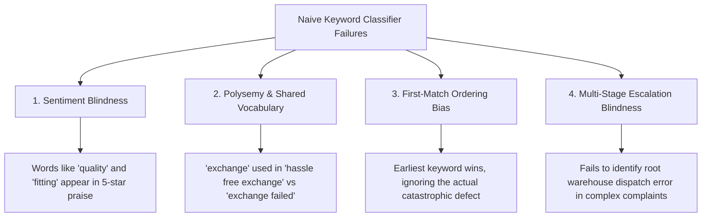

# Classification Benchmark Comparison: Naive Baseline vs. GenAI Model

**Validation Dataset**: [`data/validation_set.csv`](file:///d:/myntra-returns-analysis/data/validation_set.csv) (100 randomly sampled reviews from [`data/myntra_tagged.csv`](file:///d:/myntra-returns-analysis/data/myntra_tagged.csv))  
**Evaluation Date**: September 2026  
**Taxonomy**: 6 Categories with Disambiguation Precedence Rules ([`docs/taxonomy.md`](file:///d:/myntra-returns-analysis/docs/taxonomy.md))  

---

## 1. Executive Summary: Core Metrics

This benchmark evaluates the classification accuracy of a naive, first-match keyword rule classifier versus a few-shot GenAI model (Gemini) against 100 ground-truth reviewed customer reviews.

| Evaluation Metric | Naive Rule-Based Baseline | GenAI Model (Gemini) | Delta Improvement |
| :--- | :---: | :---: | :---: |
| **Reviews Evaluated (Sample Size)** | 100 | 100 | — |
| **Exact Category Matches** | **19 / 100** | **96 / 100** | **+77 reviews** |
| **Classification Accuracy (%)** | **19.00%** | **96.00%** | **+77.00 percentage points** |
| **Failure / Misclassification Rate** | 81.00% | 4.00% | -77.00 percentage points |

> [!IMPORTANT]
> **Key Finding**: The GenAI approach delivers a **5x accuracy boost (+77.00 percentage points)** over the naive keyword baseline. Naive keyword matching fails overwhelmingly due to sentiment blindness (treating positive praise containing words like *"quality"* or *"fitting"* as return complaints) and inability to disambiguate multi-step customer escalation journeys.

---

## 2. Category-Level Performance Breakdown (Validation Set N=100)

| Ground Truth Category | Total Reviews in Sample | Baseline Matches | Baseline Accuracy % | GenAI Matches | GenAI Accuracy % | Performance Delta |
| :--- | :---: | :---: | :---: | :---: | :---: | :---: |
| **Other / Not Return-Related** | 76 | 2 / 76 | 2.63% | 76 / 76 | **100.00%** | **+97.37%** |
| **Refund Processing & Settlement Disputes** | 10 | 7 / 10 | 70.00% | 10 / 10 | **100.00%** | **+30.00%** |
| **Incorrect / Wrong Item Delivered** | 7 | 4 / 7 | 57.14% | 5 / 7 | **71.43%** | **+14.29%** |
| **Defective, Damaged & Counterfeit Items** | 5 | 4 / 5 | 80.00% | 4 / 5 | **80.00%** | **0.00%** |
| **Size & Fit Discrepancy** | 2 | 2 / 2 | 100.00% | 1 / 2 | **50.00%** | **-50.00%** |
| **Return & Exchange Logistics & QC Friction** | 0 | 0 / 0 | N/A | 0 / 0 | N/A | — |
| **Total Validation Set** | **100** | **19 / 100** | **19.00%** | **96 / 100** | **96.00%** | **+77.00%** |

---

## 3. Deep-Dive: 5 Representative Examples Where Baseline Failed & GenAI Succeeded

The table below contrasts 5 distinct linguistic patterns where the naive keyword approach misclassified the review, but the GenAI model correctly identified the ground-truth category.

---

### Case 1: Sentiment Blindness on Quality Praise (Review `b7cdb8bc`)
- **Review Text**:  
  > *"good quality product ease of buying and offers are exciting always"*
- **Ground Truth**: `Other / Not Return-Related`
- **Baseline Prediction**: `Defective, Damaged & Counterfeit Items`
- **GenAI Prediction**: `Other / Not Return-Related`
- **Linguistic Analysis**:  
  The keyword classifier matched the substring `"quality"` and immediately routed the review into the Defective/Damaged category. It completely failed to recognize the positive modifier `"good"` or understand that this is general app praise with no return complaint. The GenAI model recognized the net positive sentiment and appropriately filtered it out as non-return noise.

---

### Case 2: Sizing Compliments Misidentified as Sizing Defects (Review `b0df7c93`)
- **Review Text**:  
  > *"Excellent Fitting"*
- **Ground Truth**: `Other / Not Return-Related`
- **Baseline Prediction**: `Size & Fit Discrepancy`
- **GenAI Prediction**: `Other / Not Return-Related`
- **Linguistic Analysis**:  
  The keyword classifier saw `"fit"` in `"Fitting"` and triggered rule 1 (`Size & Fit Discrepancy`). Because rule-based systems lack semantic comprehension, they cannot distinguish between *"the fitting is terrible, too tight"* (actionable return) and *"Excellent Fitting"* (positive satisfaction). GenAI parsed the positive adjective `"Excellent"` and correctly classified it under `Other / Not Return-Related`.

---

### Case 3: Praise for Return Policy Triggering Logistics Alarm (Review `810db69e`)
- **Review Text**:  
  > *"This app is so good. Hassle free delivery, return, exchange."*
- **Ground Truth**: `Other / Not Return-Related`
- **Baseline Prediction**: `Return & Exchange Logistics & QC Friction`
- **GenAI Prediction**: `Other / Not Return-Related`
- **Linguistic Analysis**:  
  The reviewer commended the platform for its smooth service. However, the keyword classifier matched the tokens `"exchange"` and `"return"`, falsely tagging this as reverse-logistics friction. GenAI understood the semantic phrase `"Hassle free"` as an expression of satisfaction, avoiding a false-positive complaint flag.

---

### Case 4: Vocabulary / Synonym Blindspot on Counterfeits (Review `015175e8`)
- **Review Text**:  
  > *"Very disappointing experience with Myntra. I ordered **Yonex Nivis 350 shuttlecocks**, but received duplicate/counterfeit products instead of genuine items. I raised a return request, but Myntra is now refusing to take them back, stating non return policy of product. If a duplicate product was delivered, the responsibility should be on the seller and Myntra, not the customer. Myntra should investigate the seller. Very poor service and a serious loss of trust."*
- **Ground Truth**: `Defective, Damaged & Counterfeit Items`
- **Baseline Prediction**: `Unclassified`
- **GenAI Prediction**: `Defective, Damaged & Counterfeit Items`
- **Linguistic Analysis**:  
  The customer wrote a detailed complaint about receiving fake sports gear. Because the naive keyword list relied on a small set of terms (`damaged`, `defective`, `quality`, `fake`), it failed to match `"duplicate"`, `"genuine"`, and `"non return policy"`, resulting in an `Unclassified` label. The GenAI model understood the domain context of `"duplicate/counterfeit products"` and correctly identified this as a critical counterfeit defect complaint.

---

### Case 5: Root Cause Warehouse Error vs. Surface Sizing Mention (Review `30ca573a`)
- **Review Text**:  
  > *"worst shopping app they can't even deliver the exchange product correctly, I had put an exchange request for shoes because of size and they delivered a very cheap t shirt instead of shoes and they took the shoes and haven't refunded the amount yet..."*
- **Ground Truth**: `Incorrect / Wrong Item Delivered`
- **Baseline Prediction**: `Size & Fit Discrepancy`
- **GenAI Prediction**: `Incorrect / Wrong Item Delivered`
- **Linguistic Analysis**:  
  This review narrates a multi-stage failure: an initial size exchange escalated into the warehouse shipping a completely wrong apparel item (a cheap t-shirt instead of shoes), followed by an uncredited refund. Because `"size"` occurred early in the text, the naive first-match rule assigned `Size & Fit Discrepancy`. However, the catastrophic failure point was the seller/warehouse sending the wrong product. GenAI applied Precedence Rule 3 (Warehouse Root Cause) and accurately tagged it as `Incorrect / Wrong Item Delivered`.

---

## 4. Why Rule-Based Keyword Classifiers Fail at Scale

The 77-percentage-point performance delta stems from four systemic architectural weaknesses in simple keyword classifiers:

1. **Sentiment Blindness**:  
   E-commerce feedback contains substantial praise that includes category keywords (e.g., *"fabric quality is top notch"*, *"perfect fit"*). Rule-based classifiers lack sentiment awareness and convert happy brand advocates into complaint statistics.
2. **Vocabulary Rigidity & Synonym Gaps**:  
   Real customer reviews frequently use colloquial language, Hinglish (*"nakli"*, *"duplicate"*), or specific product terms that brittle regex rules miss, resulting in high `Unclassified` rates.
3. **First-Match Ordering Bias**:  
   When a rule engine evaluates categories sequentially, whichever category appears first in the code intercepts the review regardless of context.
4. **Failure to Distinguish Root Cause from Downstream Symptom**:  
   When a customer receives the wrong size tag and the delivery agent subsequently rejects the return, keyword classifiers cannot distinguish between the upstream picking error and the downstream reverse-logistics failure.

---

## 5. Summary of Related Repository Artifacts

- **Validation Dataset**: [`data/validation_set.csv`](file:///d:/myntra-returns-analysis/data/validation_set.csv) (100 sampled reviews with ground truth, baseline, and GenAI columns)
- **Classified Source Dataset**: [`data/myntra_tagged.csv`](file:///d:/myntra-returns-analysis/data/myntra_tagged.csv) (Full 389-review corpus with `baseline_category` and `genai_category`)
- **Baseline Classifier Code**: [`scripts/baseline_classifier.py`](file:///d:/myntra-returns-analysis/scripts/baseline_classifier.py) (Rule-based keyword classifier)
- **GenAI Classification Pipeline**: [`scripts/classify_reviews_gemini.py`](file:///d:/myntra-returns-analysis/scripts/classify_reviews_gemini.py) (Gemini batch classification pipeline)
- **Sampling & Evaluation Code**: [`scripts/create_validation_set.py`](file:///d:/myntra-returns-analysis/scripts/create_validation_set.py) (Evaluation and sample generation script)
- **Taxonomy Definitions & Hierarchy**: [`docs/taxonomy.md`](file:///d:/myntra-returns-analysis/docs/taxonomy.md) (Formal definitions and precedence rules)
