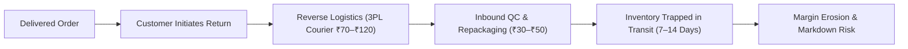

# Project Charter: Reducing Avoidable Apparel Returns on Myntra

**Document Reference**: CHARTER-MYN-2026-01  
**Project Phase**: Phase 0 — Problem Framing & Strategic Foundation  
**Focus Area**: E-Commerce Reverse Logistics & Pre-Purchase Experience Optimization  
**Date**: September 2026  
**Document Version**: 1.0 (Final)  

---

## 1. Problem Statement

Apparel returns constitute one of the largest margin drains in modern fashion e-commerce. In the Indian online retail landscape, apparel return rates are widely cited between **25% and 40%**—significantly higher than general merchandise categories and offline brick-and-mortar stores (~8%–10%).

The primary driver of this discrepancy is the inherent sensory gap of digital shopping: customers cannot touch the fabric, evaluate drape, or try garments on before purchase. When compounded by inconsistent sizing standards across brands, inaccurate brand size charts, and ambiguous catalog imagery, consumers frequently experience sizing/fit disappointment or adopt compensatory behaviors like "bracketing" (purchasing multiple sizes with the explicit intent of returning the ill-fitting ones).

---

## 2. Why It Matters to the Business (Unit Economics & Margin Leakage)

Returns are not merely an operational inconvenience; they directly erode unit economics across multiple cost centers:

1. **Direct Reverse Logistics Costs**: Every return incurs dedicated 3PL two-way shipping, handling, and doorstep collection expenses (~₹70 to ₹120 per return trip).
2. **Operational Overhead**: Returned items require manual warehouse grading, de-tagging/re-tagging, ironing, repackaging, and restocking.
3. **Working Capital & Inventory Depreciation**: In fast-fashion, inventory tied up in transit for 7–14 days misses critical seasonal demand windows, often forcing subsequent clearance markdowns.
4. **Customer Lifetime Value (LTV) Erosion**: Failed sizing and protracted reverse logistics create friction that drives high customer churn.

> [!IMPORTANT]
> **The Leverage of Return Reduction**: On a platform operating at Myntra's scale (tens of millions of monthly shipments), **reducing size- and info-related returns by even 2 to 3 percentage points unlocks tens of crores in annual EBITDA savings** by directly slashing reverse shipping overhead and recovered gross margin.

---

## 3. Hypothesis

> **Core Hypothesis**: A meaningful proportion of apparel returns are **avoidable returns**—triggered by size/fit mismatches, misleading catalog specifications, and inadequate pre-purchase sizing guidance, rather than genuine product defects or buyer remorse. 

By introducing structured pre-purchase interventions (e.g., cross-brand size standardizations, customer body-measurement fit predictors, verified customer fit reviews, and clear fabric stretch indicators), fashion platforms can preemptively resolve uncertainty at the point of decision, arresting the return before dispatch.

---

## 4. What We Will Validate (Scope & Methodology)

Because internal return logistics databases and Warehouse Management System (WMS) reason codes are proprietary and confidential, this study leverages **authentic, unfiltered Google Play Store customer reviews** as a primary voice-of-customer (VoC) proxy.

| Validation Dimension | Research Question | Proxy Metric in Review Corpus |
| :--- | :--- | :--- |
| **Avoidable vs. Non-Avoidable Share** | What percentage of complaints stem from sizing/fit and catalog misrepresentation vs. true merchandise defects? | % share of reviews tagged under *Size & Fit* vs. *Defective/Damaged* |
| **Fulfillment vs. Customer Error** | How much return friction is caused by upstream warehouse picking errors (wrong SKU/size tag dispatched) vs. true fit failure? | Prevalence of *Incorrect / Wrong Item Delivered* vs. *Size & Fit Discrepancy* |
| **Downstream Process Breakdowns** | What secondary operational hurdles (doorstep QC refusals, delayed refunds) aggravate the initial return trigger? | Volume and sentiment impact of *Logistics & QC Friction* and *Refund Settlement Disputes* |
| **Sentiment Severity** | Which specific return categories inflict the steepest drop in customer ratings and brand trust? | Category-level average star rating and review sentiment distribution |

By constructing an NLP classification pipeline with deterministic disambiguation rules, this project translates qualitative customer narratives into quantitative return drivers, identifying the highest-leverage interventions for product and operations teams.
