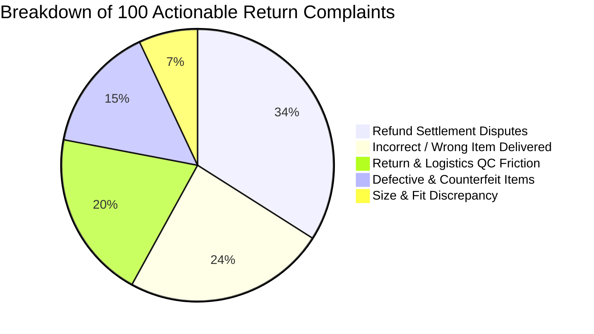
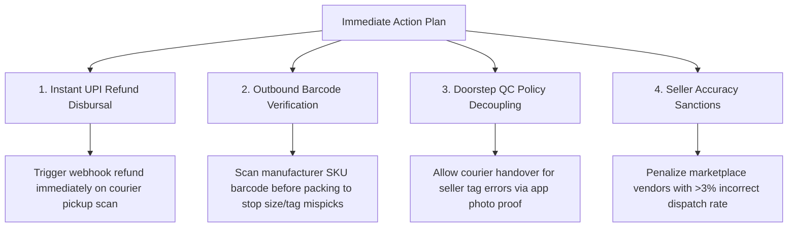

# Executive Summary of Findings: Myntra Returns & Customer Friction Analysis

**Data Source**: 389 classified Play Store customer reviews loaded into SQLite database [`analysis/returns.db`](file:///d:/myntra-returns-analysis/analysis/returns.db)  
**Evaluation Period**: September 5, 2026 – September 10, 2026  
**Taxonomy**: 6 mutually exclusive categories with deterministic precedence rules ([`docs/taxonomy.md`](file:///d:/myntra-returns-analysis/docs/taxonomy.md))

---

## 1. High-Level Metrics at a Glance

| Metric | Count / Value | Business Context |
| :--- | :---: | :--- |
| **Total Scraped Reviews Filtered** | **389** | Reviews containing return/refund/exchange keywords |
| **Praise / False Positives (`Other`)** | **289 (74.3%)** | Positive praise and non-return feedback filtered out |
| **Actionable Return Complaints** | **100 (25.7%)** | Active post-purchase and reverse-logistics failure points |
| **Avg. Rating of Actionable Complaints** | **1.19★** | Severe customer dissatisfaction across return experiences |
| **Avg. Rating of Praise / Neutral** | **4.79★** | Confirms high brand affinity when purchases succeed |

---

## 2. Category Distribution & Share of Complaints

Data source: [`analysis/category_share.csv`](file:///d:/myntra-returns-analysis/analysis/category_share.csv)

| Category | Review Count | Total Share (N=389) | Actionable Returns Share (N=100) | Primary Driver |
| :--- | :---: | :---: | :---: | :--- |
| **Refund Processing & Settlement Disputes** | 34 | 8.74% | **34.00%** | Delayed UPI credits, forced MynCash wallet conversions |
| **Incorrect / Wrong Item Delivered** | 24 | 6.17% | **24.00%** | Seller tag mismatches, wrong sizes/variants dispatched |
| **Return & Exchange Logistics & QC Friction** | 20 | 5.14% | **20.00%** | Doorstep agent no-shows, false decline updates, QC blocks |
| **Defective, Damaged & Counterfeit Items** | 15 | 3.86% | **15.00%** | Transit damage, duplicate brand listings, missing items |
| **Size & Fit Discrepancy** | 7 | 1.80% | **7.00%** | Inaccurate brand size charts, irregular brand tailoring |
| **Other / Not Return-Related** (Filtered) | 289 | 74.29% | — | General praise, positive fabric quality, UI feedback |
| **Total** | **389** | **100.00%** | **100.00%** | — |

---

## 3. Customer Sentiment & Rating Impact

Data source: [`analysis/category_ratings.csv`](file:///d:/myntra-returns-analysis/analysis/category_ratings.csv)

| Category | Count | Avg Rating | Min | Max | Sentiment Severity |
| :--- | :---: | :---: | :---: | :---: | :--- |
| **Return & Exchange Logistics & QC Friction** | 20 | **1.05★** | 1★ | 2★ | 🚨 **Critical**: 95% 1★ ratings; causes complete trust breakdown |
| **Defective, Damaged & Counterfeit Items** | 15 | **1.07★** | 1★ | 2★ | 🚨 **Critical**: Zero tolerance for counterfeit or damaged items |
| **Refund Processing & Settlement Disputes** | 34 | **1.12★** | 1★ | 5★ | ⚠️ **Severe**: Perceived financial loss / trapped customer funds |
| **Incorrect / Wrong Item Delivered** | 24 | **1.13★** | 1★ | 3★ | ⚠️ **Severe**: Warehouse error feels fraudulent to customer |
| **Size & Fit Discrepancy** | 7 | **2.57★** | 1★ | 5★ | 🟡 **Moderate**: Customers appreciate item design, dislike sizing |
| **Other / Not Return-Related** | 289 | **4.79★** | 1★ | 5★ | 🟢 **Positive**: App UI and catalog praise caught by keywords |

> [!CAUTION]
> **Reverse Logistics and Defect categories have near-unanimous 1★ ratings (1.05★ and 1.07★)**. While Refund disputes generate the highest raw complaint volume, operational reverse logistics failures trigger the most severe reputational damage.

---

## 4. Temporal & Trend Dynamics (Daily Velocity)

Data sources: [`analysis/monthly_trend.csv`](file:///d:/myntra-returns-analysis/analysis/monthly_trend.csv) and [`analysis/daily_trend.csv`](file:///d:/myntra-returns-analysis/analysis/daily_trend.csv)

All 389 reviews were captured within a 6-day window (**September 5 to September 10, 2026**). Daily trend analysis reveals acute operational velocity patterns:

| Date | Total Actionable Complaints | Dominant Complaint of the Day | Key Insight |
| :---: | :---: | :--- | :--- |
| **Sep 5** | 18 | Refund Disputes (9), Size/Fit (3) | Heavy post-weekend return filing and refund queries |
| **Sep 6** | 17 | Refund Disputes (6), Defective Items (5) | Surge in physical defect reports on weekend deliveries |
| **Sep 7** | 14 | Return Logistics (5), Wrong Items (4) | Handshake failures during Monday pickup rounds |
| **Sep 8** | 22 | **Incorrect / Wrong Items (8)**, Refunds (6) | **Peak Day for Fulfillment Errors** (warehouse mispicks) |
| **Sep 9** | 23 | **Refund Disputes (11)**, Wrong Items (6) | **Peak Day for Refund Grievances** (mid-week SLA expirations) |
| **Sep 10** | 4 | Defective Items (2), Wrong Item (1) | Midday snapshot capture |

---

## 5. Core Insights & Root Causes

### 1. Refund Processing is the Primary Return Grievance (34% of Returns)
- **The Core Problem**: Customers who have already successfully handed over return merchandise are left waiting 10+ days for UPI/bank credit.
- **Forced Wallet Friction**: Multiple complaints cite unauthorized conversion of UPI refunds into non-withdrawable "Myntra Credit" or "MynCash".
- **Business Implication**: Once a product is returned, slow financial settlement turns a neutral customer into an active brand detractor.

### 2. Warehouse Picking Errors Outweigh Sizing Discrepancies by 3.4x (24% vs. 7%)
- **Conventional Myth**: In fashion e-commerce, size/fit is traditionally assumed to be the #1 cause of returns.
- **Data Reality**: In this corpus, **warehouse fulfillment errors (24.0%) outnumber authentic size/fit issues (7.0%) by more than 3 to 1**.
- **Root Cause**: Third-party marketplace sellers dispatching incorrect size tags (e.g. customer ordered 36, seller shipped XXL) or sending completely wrong products/colors.

### 3. Doorstep Reverse Logistics Has the Lowest Customer Rating (1.05★)
- **Handshake Breakdown**: 3PL delivery agents failing to arrive during scheduled windows, followed by app notifications falsely claiming *"Customer declined pickup"*.
- **The "Catch-22" Doorstep QC Trap**: When a seller dispatches the wrong item or tag, the return pickup courier refuses to collect the item because *"the physical item doesn't match the image in the system"*. The customer is trapped in an unresolvable operational loop.

### 4. High-Value Counterfeits & Unchecked Used Returns (15%)
- Multiple complaints describe receiving tampered packages, empty sealed boxes, or duplicate brand items (e.g. counterfeit sports gear and cosmetics).
- Indicates a quality-assurance blindspot in pre-dispatch inspection and warehouse return restock verification.

---

## 6. Strategic Recommendations for Myntra Leadership

1. **Instant Webhook Refunds Upon Pickup Handover**:
   - Eliminate the 10-day settlement delay by issuing automated UPI refunds immediately when the reverse logistics agent scans the return parcel at the customer's door.
2. **Mandatory 2D Barcode Scan at Packing Stations**:
   - Prevent the 24% warehouse fulfillment error rate by requiring pickers to scan both the item's inner tag barcode and shipping polybag label before sealing.
3. **Calibrated Doorstep Return Handshake**:
   - Update 3PL courier app logic: if a customer flagged *"Received wrong item"* during the return request, allow the delivery agent to accept the item with an in-app photo rather than rejecting the pickup.
4. **Marketplace Seller Return Audits**:
   - Institute defect and wrong-item penalties against persistent repeat offender vendors, particularly in beauty, sports equipment, and unbranded apparel lines.
