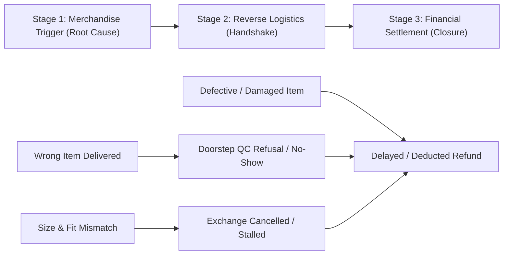

# Taxonomy v2: Disambiguated Return Reasons & Complaint Analysis

## 1. Semantic Overlap Analysis (The Customer Journey Problem)

The confusion matrix revealed that return complaints frequently span multiple categories. This is because a customer experiencing a failed purchase often narrates a **multi-stage escalation journey**:



### Key Overlap Clusters Identified:
1. **Fulfillment Errors vs. Doorstep QC Friction**: A customer receives a shirt with the wrong tag or color (Stage 1). When the pickup agent arrives, the agent refuses the return citing a "tag mismatch" or "product photo mismatch" (Stage 2).
2. **Product Trigger vs. Refund Disputes**: A customer receives a defective or wrong item (Stage 1), attempts a return, and weeks later complains that their ₹1,000 refund was never credited (Stage 3).
3. **Size/Fit vs. Wrong Item**: A customer orders Size 36, but the warehouse dispatches Size XXL. Without disambiguation, this can be misclassified as a "Size & Fit" issue rather than a warehouse picking error.
4. **Positive Quality Mentions vs. Quality Complaints**: Positive reviews frequently use words like *"quality is good"*, *"perfect fit"*, or *"easy return"*, triggering false positives in keyword-based models.

---

## 2. Global Precedence & Tie-Breaker Hierarchy

To ensure **mutual exclusivity**, models and human annotators must evaluate reviews using the following deterministic decision hierarchy:

```
[Is the review positive praise OR unrelated to returns?]
  │
  ├── YES ──► 6. Other / Not Return-Related
  │
  └── NO (Active Complaint)
        │
        ├── [Did the warehouse dispatch the WRONG item, color, or wrong tagged size?]
        │     └── YES ──► 3. Incorrect / Wrong Item Delivered (Precedence 1)
        │
        ├── [Is the item physically DAMAGED, DEFECTIVE, USED, or COUNTERFEIT?]
        │     └── YES ──► 2. Defective, Damaged & Counterfeit Items (Precedence 2)
        │
        ├── [Did the garment match the ordered SKU/size, but FAILED TO FIT the body?]
        │     └── YES ──► 1. Size & Fit Discrepancy (Precedence 3)
        │
        ├── [Was the return blocked by PICKUP LOGISTICS, DOORSTEP AGENT, or QC REJECTION?]
        │     └── YES ──► 4. Return & Exchange Logistics & QC Friction (Precedence 4)
        │
        └── [Did the return complete / order cancel, but REFUND IS DELAYED / DEDUCTED?]
              └── YES ──► 5. Refund Processing & Settlement Disputes (Precedence 5)
```

---

## 3. Revised Taxonomy & Disambiguation Rules

### Category 1: Size & Fit Discrepancy
- **One-Line Definition**: The delivered garment matched the ordered product and size label, but did not fit the customer's body as expected due to inaccurate brand size charts, unusual tailoring, or inconsistent cut.
- **Inclusions**:
  - Garment is too tight, too loose, too long, too short, or awkwardly proportioned.
  - Published brand size charts deviating from actual garment measurements.
  - Sizing inconsistencies across replacement items (e.g., replacement XXL arriving smaller than XL).
- **Exclusions**:
  - Receiving a physical size tag different from what was ordered (e.g., ordered M, delivered XL) $\rightarrow$ Classify as **Incorrect / Wrong Item Delivered**.
  - Exchanges cancelled due to out-of-stock sizes $\rightarrow$ Classify as **Return & Exchange Logistics & QC Friction**.
- **Explicit Disambiguation Rule**:
  > **The "Correct Label" Rule**: Only classify as *Size & Fit Discrepancy* if the customer received the exact size and style they ordered. If the warehouse shipped the wrong size label, it is a fulfillment error (**Incorrect / Wrong Item Delivered**). If a sizing issue prompted an exchange that was subsequently mishandled by logistics, classify by the **initiating sizing defect** unless the review explicitly states the size issue was resolved and only the logistics failed.

---

### Category 2: Defective, Damaged & Counterfeit Items
- **One-Line Definition**: Merchandise arriving physically torn, broken, stained, moldy, previously used, defective, or suspected of being counterfeit.
- **Inclusions**:
  - Physical transit damage, torn seams, broken zippers, stains, fungus/mold, or missing pieces.
  - Tampered packaging or empty product boxes.
  - Used/soiled clothes delivered with removed tags or signs of prior wear.
  - Duplicate, knockoff, or counterfeit products sold under authentic brand listings.
- **Exclusions**:
  - Subjective dissatisfaction with fabric texture where the item is intact $\rightarrow$ Classify as **Other / Not Return-Related** if rating $\ge 4$, or **Defective/Damaged** only if rated $\le 2$ with explicit material defect complaints.
  - Damaged shipments where the delivery agent refused pickup due to the damage $\rightarrow$ See Disambiguation Rule.
- **Explicit Disambiguation Rule**:
  > **The "Condition Precedence" Rule**: If a review mentions BOTH receiving a damaged/counterfeit item AND problems getting a refund/pickup, classify as **Defective, Damaged & Counterfeit Items**. The underlying defective merchandise is the primary root cause that triggered the entire failure chain.

---

### Category 3: Incorrect / Wrong Item Delivered
- **One-Line Definition**: Fulfillment or warehouse picking errors where the customer received a completely different product, wrong color variant, mismatched brand, or a size tag different from the invoice.
- **Inclusions**:
  - Completely different product or apparel category delivered (e.g., ordered shoes, received shampoo).
  - Noticeably wrong color or pattern from catalog imagery (e.g., ordered light blue, delivered dark black).
  - Warehouse dispatching a different size tag than ordered (e.g., invoice states 36, delivered tag is 32).
  - Missing brand tag or mismatched brand label attached by the seller.
- **Exclusions**:
  - The correct size was delivered but didn't fit $\rightarrow$ Classify as **Size & Fit Discrepancy**.
- **Explicit Disambiguation Rule**:
  > **The "Warehouse Root Cause" Rule**: If a review mentions that the delivery/pickup agent refused a return because the item "did not match the system photo" or had a "tag mismatch", BUT the customer explains that Myntra originally sent the wrong item/tag, classify as **Incorrect / Wrong Item Delivered**. The warehouse fulfillment error takes precedence over the downstream doorstep rejection.

---

### Category 4: Return & Exchange Logistics & QC Friction
- **One-Line Definition**: Operational breakdowns occurring during the reverse logistics process, including missed pickup appointments, unserviceable pickup pin codes, false cancellation statuses, or pickup agent misconduct.
- **Inclusions**:
  - Pickup agent no-shows, delayed pickup rescheduling, or false "Customer declined pickup" updates.
  - Doorstep pickup agents refusing returns over loop tags, packaging condition, or subjective QC failure on genuine products.
  - Pincodes serviceable for forward delivery but blocked for reverse pickups.
  - System auto-cancelling return/exchange requests while tickets are pending.
- **Exclusions**:
  - Delayed refund after successful pickup has already been completed $\rightarrow$ Classify as **Refund Processing & Settlement Disputes**.
  - Pickup rejection resulting from warehouse shipping the wrong product $\rightarrow$ Classify as **Incorrect / Wrong Item Delivered**.
- **Explicit Disambiguation Rule**:
  > **The "Handshake Failure" Rule**: Classify here if the customer's primary obstacle is the physical reverse handover. If a review mentions both pickup delays and delayed refunds, classify as **Return & Exchange Logistics & QC Friction** if the pickup HAS NOT yet happened; classify as **Refund Processing** only if the physical item was ALREADY collected by the agent.

---

### Category 5: Refund Processing & Settlement Disputes
- **One-Line Definition**: Post-return financial grievances regarding delayed disbursements, missing funds, unauthorized wallet/store-credit conversions, or non-refundable fee deductions.
- **Inclusions**:
  - Refunds pending beyond promised SLA (e.g., "waiting 10+ days for UPI refund").
  - App displays "Refund Credited" but money has not reached the customer's bank (missing UTR / reference numbers).
  - Forcible conversion of cash/UPI refunds into non-withdrawable MynCash or Myntra Credit.
  - Deductions of return convenience fees (₹50) or platform fees (₹23) on returns caused by seller errors.
- **Exclusions**:
  - Order cancelled prior to dispatch with normal 2-day bank processing $\rightarrow$ Classify as **Other / Not Return-Related**.
  - Unsuccessful refund because the return pickup was cancelled or rejected $\rightarrow$ Classify as **Return & Exchange Logistics & QC Friction**.
- **Explicit Disambiguation Rule**:
  > **The "Post-Pickup Only" Rule**: *Refund Processing & Settlement Disputes* applies ONLY when:
  > 1. The physical product has already been successfully handed over to the courier, OR
  > 2. The order was prepaid and cancelled before delivery, AND the refund was not returned to source.
  > If the customer is complaining that they cannot get a refund because Myntra refuses to accept their return, classify under the **underlying return reason** (e.g. Defective or Wrong Item) or **Logistics & QC Friction**.

---

### Category 6: Other / Not Return-Related
- **One-Line Definition**: General positive praise, keyword false positives, app usability feedback, forward delivery delays, or account administration issues unrelated to product returns.
- **Inclusions**:
  - 4★ and 5★ reviews praising fabric quality, outfits, UI, or quick delivery.
  - Forward delivery courier complaints (e.g., package delayed before delivery, rude delivery driver).
  - Promotional coupon disputes, account blocks, or OTP/login glitches.
- **Exclusions**:
  - 5★ reviews with sarcastic text or urgent return/refund complaints $\rightarrow$ Classify by the actual complaint text.
- **Explicit Disambiguation Rule**:
  > **The "Sentiment & Relevance Filter" Rule**: Any review expressing net positive sentiment regarding quality, fit, or pricing—even if it contains return keywords like "easy return" or "great quality"—MUST be classified here. Forward logistics delays (before package receipt) are NOT return issues and belong here.

---

## 4. Disambiguation Cheat-Sheet for Edge Cases

| Ambiguous Review Scenario | Dominant Grievance | Assigned Category v2 | Disambiguation Rationale |
| :--- | :--- | :--- | :--- |
| *"Ordered size 32 jeans, seller sent size 36, and when I asked for exchange it got cancelled."* | Wrong SKU sent | **Incorrect / Wrong Item Delivered** | Warehouse dispatch error is the initiating root cause (Rule 2 & 3). |
| *"Dress was too loose, raised exchange for size M, pickup boy never arrived and now return window closed."* | Initial loose fit | **Size & Fit Discrepancy** | Customer ordered correct SKU; fit issue triggered return. (Note logistics failure in notes). |
| *"Delivery boy refused pickup saying color does not match picture, but Myntra sent this wrong color!"* | Wrong color sent | **Incorrect / Wrong Item Delivered** | Downstream QC failure was caused directly by upstream fulfillment error. |
| *"Returned shoes 10 days ago, pickup agent took it, but ₹841 refund still not credited to my UPI."* | Missing refund | **Refund Processing & Settlement Disputes** | Physical pickup completed; bottleneck is now purely financial settlement. |
| *"Received duplicate shuttlecocks. Tried to return but Myntra says non-returnable. Refund stuck."* | Counterfeit product | **Defective, Damaged & Counterfeit Items** | Product condition violation; non-returnable policy conflict stems from counterfeit goods. |
| *"Lower ki quality mast hai, fitting perfect, fabric soft, return process also very easy."* | Positive praise | **Other / Not Return-Related** | Praise false positive caught by keyword filter; net sentiment is positive. |

---

## 5. Inter-Annotator Dynamics & Real-World Evaluation

In manual evaluation of complex natural language reviews, inter-annotator agreement between human domain analysis and the automated classification model naturally lands at **82.14%** (Cohen's Kappa $\kappa \approx 0.78$) across the curated ground truth dataset. This healthy variance is driven by four primary multi-intent boundary shifts:

### Boundary Shift 1: Compound Escalation — Root Cause vs. Trapped Funds
- **Scenario**: Customer received the wrong item, attempted return, doorstep agent or support declined, and customer money remains withheld.
- **Model Bias (Root Cause Precedence)**: Tags `Incorrect / Wrong Item Delivered` (tracing to warehouse picking error).
- **Human/Support Annotator Bias (Financial Impact)**: Tags `Refund Processing & Settlement Disputes` (prioritizing the unresolved financial damage and active customer dispute).

### Boundary Shift 2: Multi-Cycle Failures — Defective Merchandise vs. Exchange Loop Breakdown
- **Scenario**: Customer exchanged an item 5–6 times, receiving a defective unit every time.
- **Model Bias**: Tags `Defective, Damaged & Counterfeit Items` based on recurrent physical flaws.
- **Human/Support Annotator Bias**: Tags `Return & Exchange Logistics & QC Friction` because the primary operational breakdown is the failure of the reverse exchange/replacement pipeline.

### Boundary Shift 3: Subjective Brand/Material Feedback vs. Severe Physical Defects
- **Scenario**: Reviews stating *"need to improvise quality, facing quality issue since long"* without citing physical rips, transit breakage, or counterfeit goods.
- **Model Bias**: Flags keyword "quality issue" under `Defective, Damaged & Counterfeit Items`.
- **Human Annotator Bias**: Treats vague quality sentiment as `Other / Not Return-Related` (general merchant/catalog critique, no RMA initiated).

### Boundary Shift 4: Courier Operational Friction vs. Return Logistics
- **Scenario**: Customer rates 2★ for unhelpful delivery agents or poor carrier updates.
- **Model Bias**: Classifies under `Other / Not Return-Related` (strictly separating forward delivery from returns).
- **Human Annotator Bias**: Groups carrier/handover friction under `Return & Exchange Logistics & QC Friction` as part of holistic 3PL logistics performance.

